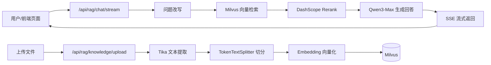

# TinyRAG


> 面向企业内部知识库的极简 RAG 项目：可上传文档入库，并进行流式问答。  
> 技术栈：Spring Boot + Spring AI + Milvus + DashScope（Qwen）。

---

## 项目亮点

- 基于 `SseEmitter` 的流式回答（非 Flux 接口）
- 问题改写（Rewrite）→ 向量检索（Milvus）→ 重排（Rerank）→ 生成回答（Qwen3-Max）
- Rerank 走百炼原生接口，兼容 `qwen3-rerank` 实际参数格式
- 上传接口支持 `DOC` / `DOCX` / `PDF` / `MD`，解析使用 `Apache Tika`
- 内置前端页面，跟随后端一起启动，无需单独前端工程
- 控制器保持轻量：核心流程集中在 Service 层

---

## 架构流程



---

## 技术栈

- Java `17`
- Spring Boot `3.5.7`
- Spring AI `1.1.2`
- Milvus（向量数据库）
- DashScope（百炼）
  - OpenAI 兼容接口：聊天与向量模型
  - 原生 Rerank 接口：`qwen3-rerank`
- Apache Tika `2.9.2`

---

## 快速开始

### 1）前置条件

- 已启动 Milvus（默认 `localhost:19530`）
- 可用 DashScope API Key
- JDK 17+

### 2）环境变量（推荐）

```bash
export DASHSCOPE_API_KEY=你的真实Key
export MILVUS_HOST=localhost
export MILVUS_PORT=19530
```

### 3）启动项目

```bash
./mvnw spring-boot:run
```

浏览器访问：`http://localhost:8080/`

- 左侧菜单「上传文件」：文档入库与向量化
- 左侧菜单「流式问答」：企业知识库问答

---

## 核心接口

### 1）上传文件并向量化

`POST /api/rag/knowledge/upload`

- `Content-Type`: `multipart/form-data`
- 参数：
  - `file`（必填）：仅支持 `DOC` / `DOCX` / `PDF` / `MD` / `MARKDOWN`
  - `kb`（可选）：知识库标识，默认 `default`
- 文件大小限制：默认 `20MB`

```bash
curl -X POST 'http://localhost:8080/api/rag/knowledge/upload' \
  -F 'file=@./docs/employee-handbook.md' \
  -F 'kb=hr'
```

示例返回：

```json
{
  "fileName": "employee-handbook.md",
  "kb": "hr",
  "chunkCount": 12
}
```

---

### 2）流式 RAG 问答

`POST /api/rag/chat/stream`

- `Content-Type`: `application/json`
- 返回类型：`text/event-stream`

请求示例：

```json
{
  "question": "年假最多可以累计多少天？",
  "kb": "hr"
}
```

```bash
curl -N -X POST 'http://localhost:8080/api/rag/chat/stream' \
  -H 'Content-Type: application/json' \
  -d '{"question":"年假最多可以累计多少天？","kb":"hr"}'
```

SSE 事件：

- `meta`：改写后的问题
- `refs`：命中的片段来源
- `token`：模型流式输出
- `done`：回答完成
- `error`：异常信息

---

## 配置速查

配置文件：`src/main/resources/application.yaml`

### 模型与百炼

- `spring.ai.openai.base-url`（默认 `https://dashscope.aliyuncs.com/compatible-mode`）
- `spring.ai.openai.api-key`
- `spring.ai.openai.chat.options.model`（默认 `qwen3-max`）
- `spring.ai.openai.embedding.options.model`（默认 `text-embedding-v4`）

### RAG 主流程参数

- `app.rag.rewrite-model`
- `app.rag.answer-model`
- `app.rag.rerank-model`（默认 `qwen3-rerank`）
- `app.rag.rerank-endpoint`（默认百炼 Rerank 地址）
- `app.rag.retrieve-top-k`
- `app.rag.rerank-top-n`
- `app.rag.rerank-max-document-chars`

### Chunk 切分参数（固定策略）

- `app.rag.chunk-size`
- `app.rag.min-chunk-size-chars`
- `app.rag.min-chunk-length-to-embed`
- `app.rag.max-num-chunks`

### 上传大小限制

- `spring.servlet.multipart.max-file-size`（默认 `20MB`）
- `spring.servlet.multipart.max-request-size`（默认 `20MB`）

---

## Rerank 说明（qwen3-rerank）

`qwen3-rerank` 不走 OpenAI Chat 兼容接口，而是调用百炼原生 Rerank API。

当前主请求结构：

```json
{
  "model": "qwen3-rerank",
  "query": "用户问题",
  "documents": ["候选文本1", "候选文本2"],
  "top_n": 4
}
```

实现策略：

- 优先使用 qwen3-rerank 原生结构
- 若返回格式不兼容，自动尝试兼容结构
- 若 Rerank 整体失败，回退到向量分数排序

---

## 提示词模板

提示词已模板化，不写死在 Java 代码中：

- `src/main/resources/prompts/rewrite-system.st`
- `src/main/resources/prompts/rewrite-user.st`
- `src/main/resources/prompts/answer-system.st`
- `src/main/resources/prompts/answer-user.st`

你可以直接调整模板来迭代效果，不需要改业务代码。

---

## 项目结构

```text
src/main/java/com/nageoffer/ai/tinyrag
├── config
│   ├── RAGConfiguration.java
│   └── RAGProperties.java
├── controller
│   ├── GlobalExceptionHandler.java
│   └── RAGController.java
├── model
│   ├── RAGRequest.java
│   └── UploadResponse.java
└── service
    ├── DashscopeRerankService.java
    ├── KnowledgeIngestionService.java
    └── RAGService.java
```

内置前端页面：

- `src/main/resources/static/index.html`

---

## 开发路线图

- [x] 流式 RAG 问答（SSE）
- [x] 文档上传、解析、切分、向量化入库
- [x] 问题改写 + Milvus 检索 + Rerank 重排
- [x] 基于模板文件的提示词管理
- [ ] 引入混合检索（向量 + 关键词/BM25）
- [ ] 增加引用片段高亮与答案可解释性增强
- [ ] 增加离线评测脚本（召回率/准确率）
- [ ] 增加多知识库权限隔离（企业多租户）

---

## 参与贡献

欢迎通过 PR 与问题单参与改进。

### 提交流程

1. 在代码托管平台 Fork 本仓库并创建功能分支
2. 本地开发并保证编译通过：

```bash
./mvnw -DskipTests compile
```

3. 提交前自查：
   - 接口行为未破坏现有功能
   - 配置项和 README 一致
   - 新增能力有最小可复现说明
4. 发起 PR，描述变更背景、方案与测试方式

### 问题反馈建议包含

- 问题现象与日志
- 复现步骤
- 期望行为
- 运行环境（JDK、Milvus、模型配置）

---

## 更新日志

### 2026-02-10

- 统一类命名为 `RAG*`（如 `RAGController`、`RAGService`、`RAGConfiguration`）
- 精简 Controller，流式编排逻辑下沉到 `RAGService`
- 修复 `TaskExecutor` 多 Bean 注入歧义，使用 `RAGTaskExecutor`
- 上传链路改为仅文档类型（`DOC`/`DOCX`/`PDF`/`MD`）并使用 `Tika` 解析
- 前端拆分为「上传文件 / 流式问答」双页签，优化交互与视觉
- Rerank 对齐百炼原生接口参数，规避 `qwen3-rerank` 兼容模式报错

---

## 开源许可证

本项目基于 `Apache License 2.0` 开源，详见 `LICENSE`。
